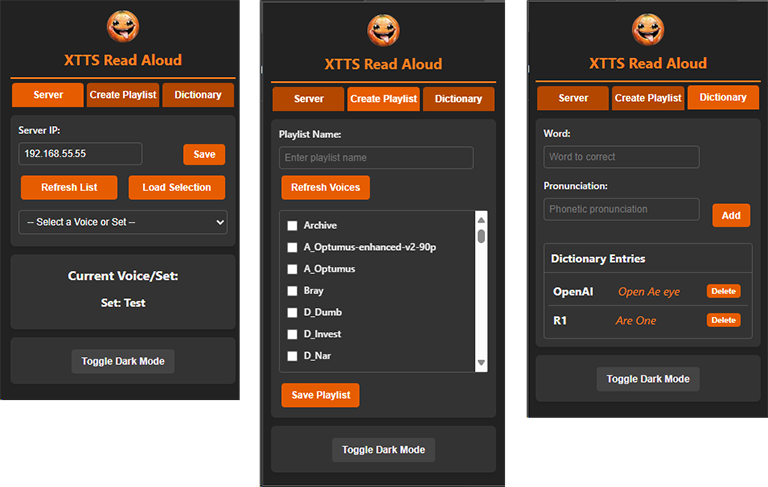

# XTTS Read Aloud

Chrome extension for reading selected text aloud with an XTTS server.

It now supports two connection modes:

- `Cloudflare Relay`: routes requests through your public Cloudflare URL
- `Direct (LAN)`: talks straight to your XTTS server on your local network

The relay mode is useful when you want the extension to work from other machines without exposing the XTTS server directly.

## What Changed

- Added Cloudflare relay mode for speaker lookup and synthesis
- Added sign-in detection for Cloudflare Access protected relays
- Fixed audio playback handoff from the extension worker to the active tab
- Added retry logic that injects the content script if the current tab has no receiver

## How It Works

### Cloudflare Relay

In relay mode, the extension sends requests to your public Cloudflare URL instead of connecting to the XTTS server directly.

Expected relay endpoints:

- `GET /api/tts/speakers`
- `POST /api/tts/synthesize`

This is the recommended mode when you are fronting XTTS with DarkFoundry or another reverse proxy over Cloudflare.

### Direct LAN

In direct mode, the extension connects straight to your XTTS server:

- `GET http://YOUR_SERVER_IP:8020/speakers`
- `POST http://YOUR_SERVER_IP:8020/tts_to_audio/`

Use this when the browser and XTTS server are on the same network and you do not need the Cloudflare relay.

## Installation

### 1. Install the XTTS server

Use the network-ready server here:

`https://github.com/psdwizzard/xtts-api-server-network`

### 2. Install the Chrome extension

1. Clone or download this repository.
2. Open `chrome://extensions/`
3. Enable `Developer mode`
4. Click `Load unpacked`
5. Select this repository folder

## Setup

### Relay Mode Setup

1. Open the extension popup.
2. Leave `Connection Mode` set to `Cloudflare Relay`.
3. Set `Relay URL` to your public Cloudflare URL.
   Example: `https://your-cloudflare-url.example.com`
4. Click `Save`.
5. Click `Refresh List`.
6. If Cloudflare Access protects the relay, complete the sign-in flow when Chrome opens it.
7. Choose a voice or set and click `Load Selection`.

### Direct LAN Setup

1. Open the extension popup.
2. Switch `Connection Mode` to `Direct (LAN)`.
3. Enter your XTTS server IP.
   Example: `192.168.1.100`
4. Click `Save`.
5. Click `Refresh List`.
6. Choose a voice or set and click `Load Selection`.

## Usage

Highlight text on a page, then either:

- right-click and choose `Read Aloud`
- use the keyboard shortcut `Ctrl+Shift+S`

## Playlists And Dictionary

- Create voice playlists from the `Create Playlist` tab
- Add pronunciation overrides in the `Dictionary` tab

## Notes

- Relay mode depends on your Cloudflare URL being reachable and correctly routed to your XTTS relay
- Direct mode depends on local network access to port `8020`
- If a page does not already have the content script loaded, the extension now injects it and retries playback automatically

## Repository Defaults

The repository now ships with a generic relay placeholder instead of a hardcoded hostname:

`https://your-cloudflare-url.example.com`

Replace that with your own Cloudflare URL in the popup before using relay mode.
